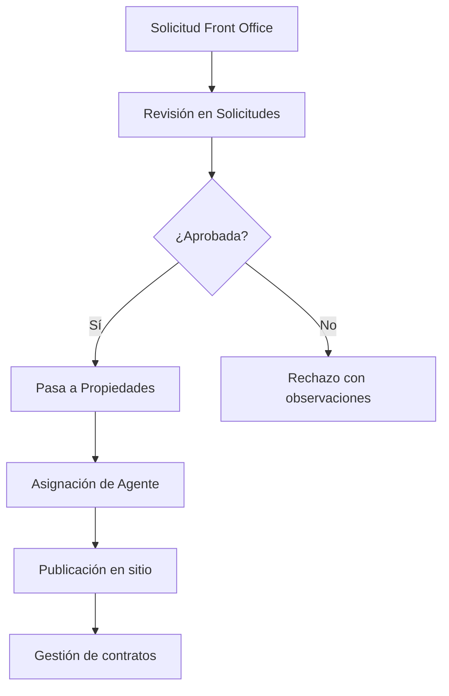
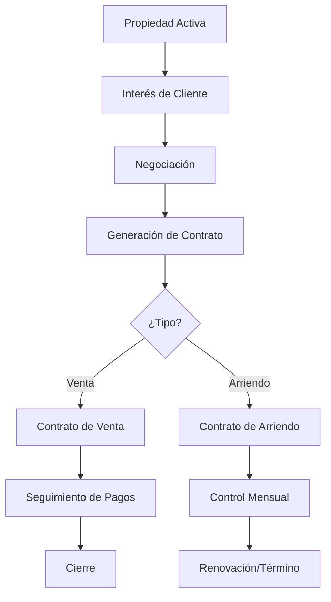
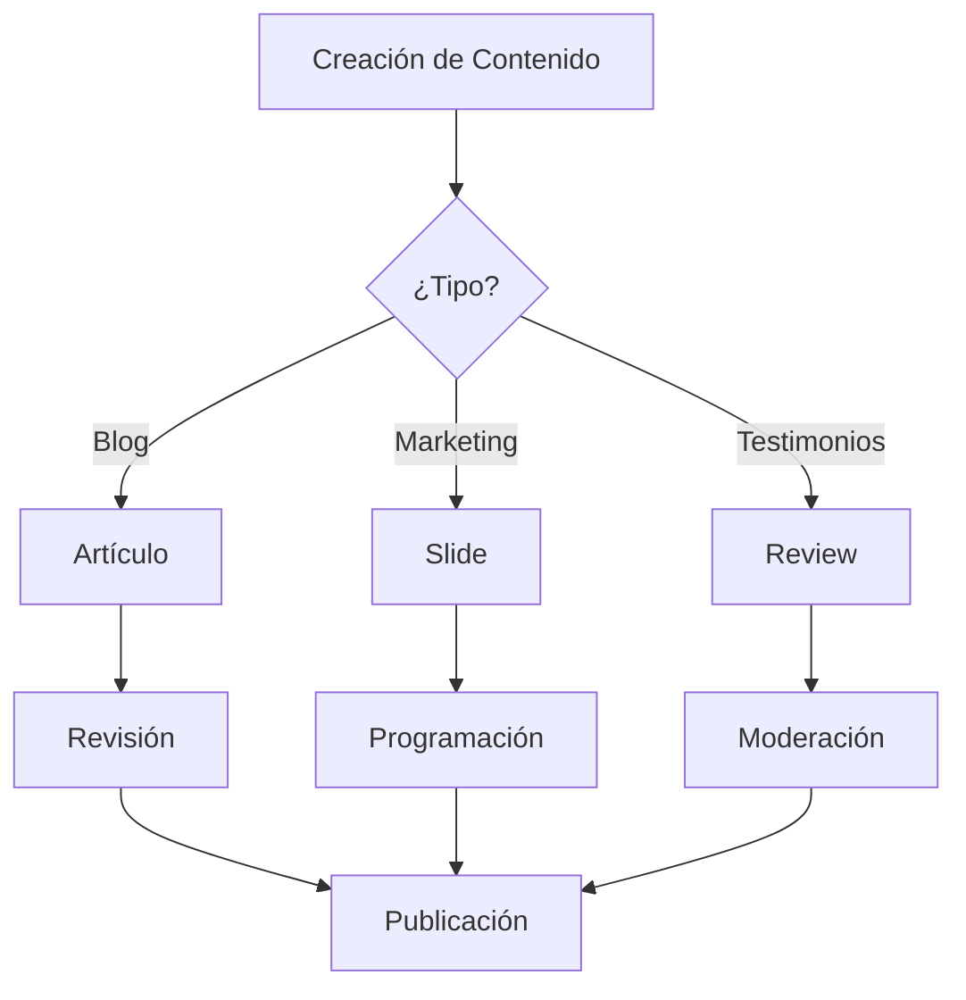

# 📋 Back Office - Álvaro Bravo Propiedades v2.1.0

## Reporte de Integración y Manual de Usuario

---

## 📖 Índice

1. [Introducción](#introducción)
2. [Arquitectura del Sistema](#arquitectura-del-sistema)
3. [Módulos Implementados](#módulos-implementados)
4. [Lógica de Uso](#lógica-de-uso)
5. [Flujos de Trabajo](#flujos-de-trabajo)
6. [Punto de Vista del Usuario](#punto-de-vista-del-usuario)
7. [Integración con Frontend](#integración-con-frontend)
8. [Consideraciones Técnicas](#consideraciones-técnicas)
9. [Próximos Pasos](#próximos-pasos)

---

## 🏢 Introducción

El Back Office de **Álvaro Bravo Propiedades** es el sistema de administración interno que permite gestionar todos los aspectos del negocio inmobiliario desde una interfaz centralizada y profesional. Este sistema está diseñado para administradores, agentes y personal interno que necesitan controlar propiedades, contratos, usuarios, contenido y estadísticas del negocio.

### 🎯 Objetivos Principales

- **Gestión Centralizada**: Todos los aspectos del negocio en un solo lugar
- **Eficiencia Operativa**: Workflows optimizados para el sector inmobiliario
- **Control de Calidad**: Procesos de aprobación y validación
- **Análisis de Datos**: Métricas y reportes para toma de decisiones
- **Experiencia de Usuario**: Interfaz intuitiva y profesional

---

## 🏗️ Arquitectura del Sistema

### 📁 Estructura de Directorios

```
app/backOffice/
├── layout.tsx                    # Layout principal con navegación
├── page.tsx                     # Dashboard con métricas generales
├── properties/                  # Gestión de propiedades
├── publication-requests/        # Solicitudes del Front Office
├── contracts/                   # Contratos de venta y arriendo
├── people/                      # Base de datos de personas
├── users/                       # Gestión de usuarios del sistema
├── agents/                      # Gestión de agentes inmobiliarios
├── testimonials/                # Gestión de testimonios
├── blog/                        # Gestión del blog corporativo
├── slider/                      # Carrusel principal del sitio
├── categories/                  # Tipos de propiedades
├── reports/                     # Reportes y análisis
└── settings/                    # Configuración del sistema
```

### 🔧 Componentes Principales

#### 1. **Layout Principal** (`layout.tsx`)
- **Sidebar Navigation**: Menú lateral con todos los módulos
- **Top AppBar**: Barra superior con título y acciones
- **Responsive Design**: Adaptable a diferentes tamaños de pantalla
- **Estado Activo**: Indica la sección actual

#### 2. **Dashboard Central** (`page.tsx`)
- **KPIs del Negocio**: Métricas clave en cards visuales
- **Gráficos de Tendencias**: Visualización de datos históricos
- **Resumen Rápido**: Información importante de un vistazo
- **Accesos Directos**: Links a acciones frecuentes

---

## 📊 Módulos Implementados

### 1. 🏠 **Propiedades** (`/backOffice/properties`)

#### **Funcionalidades:**
- ✅ Lista completa de propiedades con filtros avanzados
- ✅ Estados: Activa, Vendida, Pendiente, Inactiva
- ✅ Información detallada: precio, ubicación, características
- ✅ Asignación de agentes responsables
- ✅ Acciones: Ver, Editar, Eliminar

#### **Datos Mostrados:**
- Título y dirección de la propiedad
- Tipo (Casa, Departamento, Oficina)
- Precio en UF y pesos chilenos
- Dormitorios, baños, superficie
- Agente responsable
- Fecha de creación
- Estado actual

#### **Búsqueda y Filtros:**
- Por título, dirección o agente
- Filtro por estado
- Filtro por tipo de propiedad

---

### 2. 📝 **Solicitudes de Publicación** (`/backOffice/publication-requests`)

#### **Funcionalidades:**
- ✅ Revisión de solicitudes del Front Office
- ✅ Proceso de aprobación/rechazo
- ✅ Vista detallada con imágenes
- ✅ Gestión de observaciones

#### **Estados:**
- **Pendiente**: Esperando revisión
- **Aprobada**: Lista para publicar
- **Rechazada**: Con motivos especificados

#### **Proceso de Trabajo:**
1. Usuario envía solicitud desde Front Office
2. Aparece en la lista de solicitudes pendientes
3. Administrador revisa información completa
4. Aprueba (pasa a módulo Propiedades) o rechaza con motivos
5. Notificación al usuario solicitante

---

### 3. 📑 **Contratos** (`/backOffice/contracts`)

#### **Tipos de Contratos:**

##### **Contratos de Venta:**
- Información de comprador y vendedor
- Precio de venta y formas de pago
- Seguimiento de pagos (pie, crédito)
- Estados: Firmado, En proceso
- Documentos asociados

##### **Contratos de Arriendo:**
- Datos de arrendador y arrendatario
- Valor mensual y garantías
- Período de arriendo
- Control de pagos mensuales
- Estados: Activo, Vencido, Renovado

#### **Funcionalidades:**
- ✅ Gestión separada por tipo de contrato
- ✅ Seguimiento de pagos
- ✅ Alertas de vencimientos
- ✅ Reportes financieros

---

### 4. 👥 **Personas** (`/backOffice/people`)

#### **Tipos de Personas:**
- **Personas Naturales**: Individuos con RUT personal
- **Personas Jurídicas**: Empresas o entidades legales

#### **Roles:**
- **Comprador**: Adquiere propiedades
- **Vendedor**: Ofrece propiedades en venta
- **Arrendatario**: Arrienda propiedades
- **Arrendador**: Ofrece propiedades en arriendo

#### **Información Gestionada:**
- Datos personales completos
- Información de contacto
- Documentos asociados
- Historial de contratos
- Estado (Activo/Inactivo)

---

### 5. 👨‍💼 **Usuarios** (`/backOffice/users`)

#### **Tipos de Usuario:**
- **Administrador**: Acceso completo al sistema
- **Agente**: Gestión de propiedades asignadas
- **Cliente**: Acceso limitado al Front Office

#### **Gestión:**
- ✅ Creación y edición de cuentas
- ✅ Asignación de roles y permisos
- ✅ Control de estado (Activo/Inactivo)
- ✅ Seguimiento de actividad

---

### 6. 🏘️ **Agentes** (`/backOffice/agents`)

#### **Información del Agente:**
- Datos personales y contacto
- Especialidades (Casas, Departamentos, Oficinas)
- Experiencia en el rubro
- Propiedades asignadas

#### **Métricas de Performance:**
- Ventas del mes
- Rating promedio
- Porcentaje de rendimiento
- Comisiones generadas

---

### 7. ⭐ **Testimonios** (`/backOffice/testimonials`)

#### **Gestión de Testimonios:**
- ✅ Aprobación/rechazo de testimonios
- ✅ Sistema de calificaciones (1-5 estrellas)
- ✅ Asociación con propiedades y agentes
- ✅ Testimonios destacados para marketing

#### **Estados:**
- **Pendiente**: Esperando moderación
- **Aprobado**: Visible en el Front Office
- **Rechazado**: No se publica

---

### 8. 📰 **Blog** (`/backOffice/blog`)

#### **Gestión de Contenido:**
- ✅ Creación y edición de artículos
- ✅ Categorías: Compra, Venta, Mercado, Inversión
- ✅ Programación de publicaciones
- ✅ Gestión de imágenes destacadas

#### **Estados de Artículos:**
- **Publicado**: Visible en el sitio
- **Borrador**: En edición
- **Programado**: Publicación futura
- **Archivado**: No visible

#### **Métricas:**
- Vistas por artículo
- Likes y engagement
- Artículos más populares

---

### 9. 🎠 **Slider** (`/backOffice/slider`)

#### **Gestión del Carrusel:**
- ✅ Slides con imágenes y textos
- ✅ Enlaces internos y externos
- ✅ Control de orden de aparición
- ✅ Fechas de activación/desactivación

#### **Estadísticas:**
- Clicks por slide
- Impresiones totales
- CTR (Click Through Rate)

#### **Configuración:**
- Título and descripción
- Imagen de fondo
- Enlace de destino
- Período de vigencia

---

### 10. 🏷️ **Tipos de Propiedad** (`/backOffice/categories`)

#### **Categorías Estándar:**
- **Casa**: Viviendas unifamiliares
- **Departamento**: Unidades en edificios
- **Oficina**: Espacios comerciales
- **Terreno**: Lotes para construcción

#### **Gestión:**
- ✅ Creación de nuevas categorías
- ✅ Edición de existentes
- ✅ Control de estado (Activa/Inactiva)
- ✅ Contador de propiedades por categoría

---

### 11. 📊 **Reportes** (`/backOffice/reports`)

#### **Métricas Disponibles:**
- **Ventas Totales**: Monto y cantidad
- **Nuevos Clientes**: Registros mensuales
- **Propiedades Activas**: Inventario actual
- **Performance de Agentes**: Rankings y estadísticas

#### **Tipos de Reportes:**
- Tendencias de ventas
- Distribución por tipo de propiedad
- Ingresos mensuales
- Actividad de usuarios

#### **Exportación:**
- PDF para reportes ejecutivos
- Excel para análisis detallado

---

### 12. ⚙️ **Configuración** (`/backOffice/settings`)

#### **Configuraciones Disponibles:**

##### **General:**
- Nombre del sitio
- Información de contacto
- Descripción corporativa

##### **Notificaciones:**
- Email automáticos
- SMS alerts
- Push notifications
- Reportes semanales

##### **Seguridad:**
- Autenticación de dos factores
- Timeout de sesiones
- Políticas de contraseñas

##### **Negocio:**
- Moneda principal (CLP/USD)
- Mostrar precios en UF
- Zona horaria
- Auto-aprobación de listados

---

## 🔄 Lógica de Uso

### 📋 Flujo de Trabajo Principal

#### 1. **Gestión de Propiedades**


#### 2. **Proceso de Venta/Arriendo**


#### 3. **Gestión de Contenido**


---

## 👤 Punto de Vista del Usuario

### 🎯 Tipos de Usuarios del Back Office

#### 1. **Administrador General**
**Responsabilidades:**
- Supervisión completa del sistema
- Configuración de parámetros generales
- Gestión de usuarios y permisos
- Análisis de reportes ejecutivos

**Módulos de Acceso:**
- ✅ Todos los módulos disponibles
- ✅ Configuración del sistema
- ✅ Gestión de usuarios
- ✅ Reportes avanzados

**Flujo de Trabajo Típico:**
1. **Inicio de Día**: Revisar dashboard con métricas clave
2. **Solicitudes Pendientes**: Aprobar/rechazar nuevas propiedades
3. **Supervisión**: Verificar actividad de agentes
4. **Contenido**: Aprobar testimonios y artículos de blog
5. **Análisis**: Revisar reportes de performance

#### 2. **Agente Inmobiliario**
**Responsabilidades:**
- Gestión de propiedades asignadas
- Seguimiento de clientes
- Actualización de estados de propiedades
- Generación de contratos

**Módulos de Acceso:**
- ✅ Propiedades (limitado a asignadas)
- ✅ Contratos relacionados
- ✅ Personas/Clientes
- ✅ Dashboard personal

**Flujo de Trabajo Típico:**
1. **Gestión Diaria**: Revisar propiedades asignadas
2. **Seguimiento**: Actualizar estados de negociaciones
3. **Clientes**: Registrar nuevos contactos
4. **Contratos**: Crear y gestionar documentos
5. **Reportes**: Revisar métricas personales

#### 3. **Coordinador de Marketing**
**Responsabilidades:**
- Gestión del blog corporativo
- Administración del slider principal
- Moderación de testimonios
- Creación de contenido promocional

**Módulos de Acceso:**
- ✅ Blog
- ✅ Slider
- ✅ Testimonios
- ✅ Reportes de engagement

**Flujo de Trabajo Típico:**
1. **Contenido**: Crear y programar artículos
2. **Promociones**: Actualizar slides del carrusel
3. **Moderación**: Revisar y aprobar testimonios
4. **Análisis**: Verificar métricas de contenido

### 🖥️ Experiencia de Usuario

#### **Navegación Intuitiva**
- **Sidebar Fijo**: Acceso rápido a todos los módulos
- **Breadcrumbs**: Orientación clara de la ubicación
- **Estados Visuales**: Indicadores claros del estado actual
- **Responsive**: Funciona en desktop, tablet y móvil

#### **Interacciones Principales**

##### **Dashboard**
- **Visión General**: Métricas clave al inicio
- **Accesos Rápidos**: Botones a acciones frecuentes
- **Alertas**: Notificaciones importantes
- **Gráficos**: Visualización de tendencias

##### **Listados**
- **Tablas Interactivas**: Ordenamiento y filtrado
- **Búsqueda Global**: Encontrar información rápidamente
- **Acciones Rápidas**: Botones de acción en cada fila
- **Paginación**: Manejo eficiente de grandes volúmenes

##### **Formularios**
- **Dialogs Modales**: Edición sin cambiar de página
- **Validación en Tiempo Real**: Feedback inmediato
- **Autocompletado**: Sugerencias inteligentes
- **Guardado Automático**: Prevención de pérdida de datos

#### **Feedback Visual**
- **Estados de Carga**: Indicadores de progreso
- **Confirmaciones**: Alertas de acciones exitosas
- **Errores**: Mensajes claros de problemas
- **Tooltips**: Ayuda contextual

### 📱 Responsividad

#### **Desktop (1200px+)**
- Sidebar completo visible
- Tablas con todas las columnas
- Formularios en múltiples columnas
- Gráficos de tamaño completo

#### **Tablet (768px - 1199px)**
- Sidebar colapsable
- Tablas con columnas prioritarias
- Formularios adaptados
- Cards reorganizadas

#### **Móvil (< 768px)**
- Navigation drawer
- Vista de cards en lugar de tablas
- Formularios de una columna
- Acciones simplificadas

---

## 🔌 Integración con Frontend

### **Estructura de Datos**

#### **Propiedades**
```typescript
interface Property {
  id: number;
  title: string;
  type: PropertyType;
  address: string;
  price: number;
  uf: number;
  bedrooms: number;
  bathrooms: number;
  builtArea: number;
  landArea: number;
  status: PropertyStatus;
  agent: Agent;
  images: string[];
  features: string[];
}
```

#### **Contratos**
```typescript
interface Contract {
  id: number;
  type: 'sale' | 'rental';
  property: Property;
  parties: Person[];
  amount: number;
  startDate: string;
  endDate?: string;
  status: ContractStatus;
  payments: Payment[];
}
```

#### **Usuarios**
```typescript
interface User {
  id: number;
  name: string;
  email: string;
  role: UserRole;
  status: UserStatus;
  permissions: Permission[];
  lastLogin: string;
}
```

### **APIs Requeridas**

#### **Propiedades**
- `GET /api/properties` - Listar propiedades
- `POST /api/properties` - Crear propiedad
- `PUT /api/properties/:id` - Actualizar propiedad
- `DELETE /api/properties/:id` - Eliminar propiedad
- `GET /api/properties/:id/analytics` - Métricas de propiedad

#### **Contratos**
- `GET /api/contracts` - Listar contratos
- `POST /api/contracts` - Crear contrato
- `PUT /api/contracts/:id` - Actualizar contrato
- `GET /api/contracts/:id/payments` - Pagos del contrato

#### **Usuarios**
- `GET /api/users` - Listar usuarios
- `POST /api/users` - Crear usuario
- `PUT /api/users/:id` - Actualizar usuario
- `DELETE /api/users/:id` - Eliminar usuario

### **Autenticación y Autorización**

#### **JWT Implementation**
```typescript
// Middleware de autenticación
const authMiddleware = (requiredRole: UserRole) => {
  return (req: Request, res: Response, next: NextFunction) => {
    const token = req.headers.authorization?.split(' ')[1];
    
    if (!token) {
      return res.status(401).json({ error: 'Token required' });
    }
    
    try {
      const decoded = jwt.verify(token, JWT_SECRET) as JWTPayload;
      
      if (decoded.role !== requiredRole) {
        return res.status(403).json({ error: 'Insufficient permissions' });
      }
      
      req.user = decoded;
      next();
    } catch (error) {
      return res.status(401).json({ error: 'Invalid token' });
    }
  };
};
```

#### **Protección de Rutas**
```typescript
// Rutas protegidas por rol
app.use('/api/admin/*', authMiddleware('admin'));
app.use('/api/agent/*', authMiddleware('agent'));
app.use('/api/user/*', authMiddleware('user'));
```

---

## ⚙️ Consideraciones Técnicas

### **Performance**

#### **Optimizaciones Implementadas**
- **Lazy Loading**: Carga bajo demanda de componentes
- **Memoization**: React.memo para evitar re-renders
- **Virtual Scrolling**: Para listas grandes
- **Debouncing**: En búsquedas y filtros
- **Caching**: Almacenamiento local de datos frecuentes

#### **Bundle Size**
- **Code Splitting**: División por rutas
- **Tree Shaking**: Eliminación de código no usado
- **Compression**: Gzip/Brotli en producción
- **CDN**: Recursos estáticos optimizados

### **Seguridad**

#### **Medidas Implementadas**
- **Sanitización**: Limpieza de inputs del usuario
- **CSRF Protection**: Tokens de validación
- **Rate Limiting**: Límites de requests
- **Logging**: Registro de acciones críticas
- **Encryption**: Datos sensibles encriptados

#### **Validaciones**
- **Frontend**: Validación inmediata en formularios
- **Backend**: Validación robusta en APIs
- **Esquemas**: Definición clara de estructuras de datos

### **Escalabilidad**

#### **Arquitectura Modular**
- **Componentes Reutilizables**: DRY principle
- **Hooks Personalizados**: Lógica compartida
- **Context API**: Estado global eficiente
- **Microcomponentes**: Facilitan mantenimiento

#### **Base de Datos**
- **Indexación**: Optimización de consultas
- **Paginación**: Manejo de grandes volúmenes
- **Caching**: Redis para datos frecuentes
- **Backup**: Respaldos automáticos

---

## 🚀 Próximos Pasos

### **Fase 1: Integración Backend (4 semanas)**

#### **Semana 1-2: APIs Core**
- [ ] Implementar APIs de Propiedades
- [ ] Implementar APIs de Usuarios
- [ ] Implementar APIs de Contratos
- [ ] Sistema de autenticación JWT
- [ ] Middleware de autorización

#### **Semana 3-4: APIs Secundarias**
- [ ] APIs de Testimonios
- [ ] APIs de Blog
- [ ] APIs de Slider
- [ ] APIs de Reportes
- [ ] Sistema de notificaciones

### **Fase 2: Funcionalidades Avanzadas (6 semanas)**

#### **Semana 1-2: Upload y Media**
- [ ] Sistema de upload de imágenes
- [ ] Optimización automática de imágenes
- [ ] CDN para recursos estáticos
- [ ] Galería de imágenes para propiedades

#### **Semana 3-4: Reportes y Analytics**
- [ ] Integración con librerías de gráficos
- [ ] Dashboard interactivo
- [ ] Exportación PDF/Excel
- [ ] Google Analytics integration

#### **Semana 5-6: Notificaciones y Comunicaciones**
- [ ] Sistema de notificaciones en tiempo real
- [ ] Email templates automáticos
- [ ] SMS notifications
- [ ] Push notifications

### **Fase 3: Optimización y Testing (4 semanas)**

#### **Semana 1-2: Performance**
- [ ] Optimización de consultas DB
- [ ] Implementación de caché
- [ ] Code splitting avanzado
- [ ] SEO optimization

#### **Semana 3-4: Testing y QA**
- [ ] Tests unitarios componentes
- [ ] Tests integración APIs
- [ ] Tests end-to-end
- [ ] Performance testing
- [ ] Security testing

### **Fase 4: Deploy y Monitoreo (2 semanas)**

#### **Semana 1: Deployment**
- [ ] Setup CI/CD pipeline
- [ ] Configuración de producción
- [ ] SSL certificates
- [ ] Domain configuration
- [ ] Backup strategies

#### **Semana 2: Monitoreo**
- [ ] Error tracking (Sentry)
- [ ] Performance monitoring
- [ ] Analytics dashboard
- [ ] Health checks
- [ ] User feedback system

---

## 📞 Soporte y Mantenimiento

### **Documentación Técnica**
- **API Documentation**: Swagger/OpenAPI
- **Component Library**: Storybook
- **Database Schema**: Diagramas ERD
- **Deployment Guide**: Paso a paso

### **Training Materials**
- **User Manual**: Manual de usuario completo
- **Video Tutorials**: Capacitación por módulo
- **FAQ**: Preguntas frecuentes
- **Best Practices**: Guías de uso óptimo

### **Support Channels**
- **Technical Support**: Soporte técnico especializado
- **User Support**: Ayuda para usuarios finales
- **Bug Reports**: Sistema de reporte de errores
- **Feature Requests**: Solicitudes de nuevas funcionalidades

---

## 📊 Métricas de Éxito

### **KPIs Técnicos**
- **Uptime**: > 99.9%
- **Response Time**: < 200ms promedio
- **Error Rate**: < 0.1%
- **Page Load Speed**: < 3 segundos

### **KPIs de Negocio**
- **User Adoption**: % usuarios activos
- **Task Completion**: % tareas completadas
- **Time to Value**: Tiempo hasta primer valor
- **User Satisfaction**: Score NPS > 8

### **Monitoreo Continuo**
- **Real User Monitoring**: Experiencia real de usuarios
- **Synthetic Monitoring**: Tests automáticos
- **Business Intelligence**: Dashboards ejecutivos
- **Alerting**: Notificaciones proactivas

---

## 🎉 Conclusión

El Back Office de **Álvaro Bravo Propiedades v2.1.0** representa una solución completa y profesional para la gestión del negocio inmobiliario. Con una arquitectura moderna, interfaces intuitivas y funcionalidades específicas del sector, el sistema está diseñado para crecer con el negocio y proporcionar una ventaja competitiva significativa.

La implementación actual proporciona una base sólida que puede expandirse y adaptarse según las necesidades cambiantes del mercado inmobiliario, manteniendo siempre el foco en la experiencia del usuario y la eficiencia operativa.

---

**Última actualización**: 23 de junio de 2025  
**Versión del documento**: 1.0  
**Autor**: Equipo de Desarrollo Álvaro Bravo Propiedades
